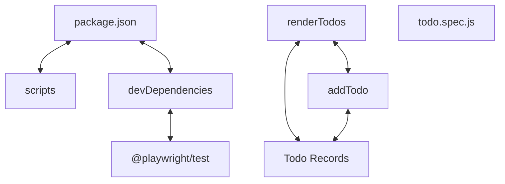

# Codebase Architectural Report

> **Auto-generated** by graphify knowledge graph analysis  
> **Purpose**: Dependency map, connection analysis, subsystem breakdown, and quality hotspots.

---

## 1. Executive Summary

- **Total Components**: `26`
- **Total Connections**: `24`
- **Subsystem Modules**: `1`
- **Dependency Types**: `5`

**Key Architectural Hubs:**

| # | Component | File | Type | Connections |
|---|-----------|------|------|-------------|
| 1 | `package.json` | `package.json` | function | 6 |
| 2 | `renderTodos` | `index.html` | function | 6 |
| 3 | `todo.spec.js` | `e2e/todo.spec.js` | file | 4 |
| 4 | `Todo Records` | `index.html` | class | 4 |
| 5 | `scripts` | `package.json` | function | 3 |
| 6 | `devDependencies` | `package.json` | function | 2 |
| 7 | `@playwright/test` | `package.json` | function | 2 |
| 8 | `addTodo` | `index.html` | function | 2 |

---

## 2. Dependency & Connection Analysis

### Relationship Types

| Relationship | Count | Share |
|-------------|-------|-------|
| `contains` | 14 | 58% |
| `calls` | 4 | 17% |
| `shares_data_with` | 4 | 17% |
| `imports` | 1 | 4% |
| `implements` | 1 | 4% |

### Hub Dependency Diagram

### Most Connected Pairs

| Component A | Component B | Shared Connections |
|-------------|-------------|-------------------|
| `openTodoApp()` | `todo.spec.js` | 1 |
| `path` | `todo.spec.js` | 1 |
| `todo.spec.js` | `{ pathToFileURL }` | 1 |
| `todo.spec.js` | `{ test, expect }` | 1 |
| `description` | `package.json` | 1 |
| `devDependencies` | `package.json` | 1 |
| `name` | `package.json` | 1 |
| `package.json` | `private` | 1 |
| `package.json` | `scripts` | 1 |
| `package.json` | `version` | 1 |

---

## 3. Subsystem & Module Breakdown

### 3.1 package.json
**Nodes**: `26`  
**Files**: `.engine/workers/7105584b7daa/scratch/findings.md`, `e2e/todo.spec.js`, `index.html`, `package.json`, `playwright.config.js`

| Component | Type | File | Connections |
|-----------|------|------|-------------|
| `package.json` | function | `package.json` | 6 |
| `renderTodos` | function | `index.html` | 6 |
| `todo.spec.js` | file | `e2e/todo.spec.js` | 4 |
| `Todo Records` | class | `index.html` | 4 |
| `scripts` | function | `package.json` | 3 |
| `devDependencies` | function | `package.json` | 2 |
| `@playwright/test` | function | `package.json` | 2 |
| `addTodo` | function | `index.html` | 2 |
| `toggleTodo` | function | `index.html` | 2 |
| `deleteTodo` | function | `index.html` | 2 |

---

## 4. API Reference

Public classes and functions by subsystem.

### package.json

| Name | Type | File | Connections |
|------|------|------|-------------|
| `package.json` | function | `package.json` | 6 |
| `renderTodos` | function | `index.html` | 6 |
| `Todo Records` | class | `index.html` | 4 |
| `scripts` | function | `package.json` | 3 |
| `devDependencies` | function | `package.json` | 2 |
| `@playwright/test` | function | `package.json` | 2 |
| `addTodo` | function | `index.html` | 2 |
| `toggleTodo` | function | `index.html` | 2 |

---

## 5. Code Quality & Architectural Risk Hotspots

### Component Type Distribution

| Type | Count | Share |
|------|-------|-------|
| function | 20 | 77% |
| class | 3 | 12% |
| file | 2 | 8% |
| method | 1 | 4% |

### Dependency Cycles

**3** circular dependency loop(s) detected:

| # | Cycle Path |
|---|-----------|
| 1 | `index_todo_records → index_toggletodo → index_rendertodos` |
| 2 | `index_addtodo → index_todo_records → index_rendertodos` |
| 3 | `index_deletetodo → index_todo_records → index_rendertodos` |

### Orphaned Components

**1** isolated node(s) with no connections:

| Component | File |
|-----------|------|
| `Test Critic Verdict` | `.engine/workers/7105584b7daa/scratch/findings.md` |

---

## 6. How to Navigate

1. **Interactive D3 Map** — open `graph.html` to explore node connections visually.
2. **Knowledge Graph Queries** — use MCP tools (`graph_query`, `graph_explain_node`, `graph_impact_radius`).
